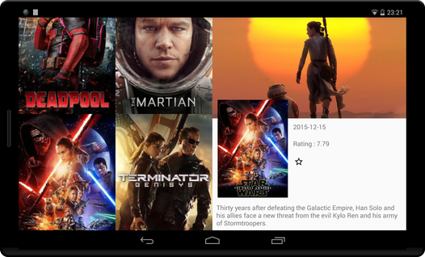
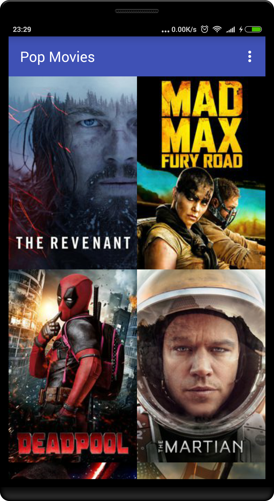

### TMDb API Key is required.

In order for this app to function properly, an API key for The Movie Database (TMDb) must be included with the build.

Obtain a key via the following [instructions](https://www.themoviedb.org/documentation/api), and include the unique key for the build by adding the following line to [USER_HOME]/.gradle/gradle.properties

`TmdbApiKey="<UNIQUE_API_KEY">`

## Images

